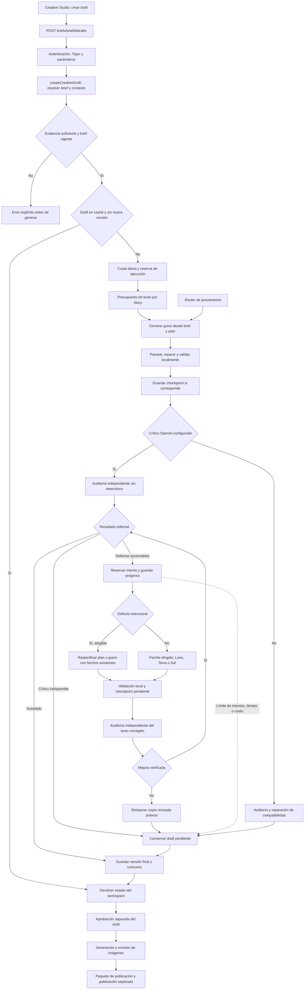
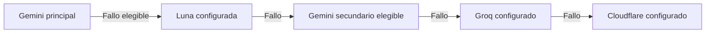

# Arquitectura de Create Carousel Draft

Fecha: 21 de septiembre de 2026. Base: `fcca4da` **más los cambios locales pendientes** inspeccionados en esta fecha. Describe la implementación observada, no una garantía de calidad ni una arquitectura futura. Configuración de modelos: valores predeterminados del código, no credenciales ni configuración privada del entorno.

Representación estructurada: [carousel-draft-architecture.json](carousel-draft-architecture.json).

## Qué produce

La operación transforma un brief con evidencia y plan narrativo en un draft versionado: guion por diapositiva, caption, hashtags, accesibilidad, dirección visual y evaluación editorial. Puede devolver un draft aceptado, pendiente de revisión o rechazado. Una ejecución completada no significa aprobación.

Crear el draft **no genera imágenes ni publica**. La aprobación del texto, la producción de assets y la publicación son operaciones posteriores con sus propios controles.

## Diagrama arquitectónico



Las flechas de reparación representan decisiones acotadas, no reintentos infinitos. El motor puede continuar al siguiente nivel después de rechazar un parche; el diagrama agrupa sus salidas de parada para facilitar la lectura.

## Componentes y responsabilidades

| Componente | Responsabilidad | Fuente |
|---|---|---|
| Ruta HTTP | Autenticar, validar UUID y cuerpo, resolver Topic, mapear errores | `src/app/api/radar/creative/briefs/[briefId]/drafts/route.ts` |
| Servicio de aplicación | Vigencia, caché, cuota, reserva, checkpoints y persistencia | `src/app/modules/stories/manage-creative-content.ts`, `createCreativeDraft` |
| Generador | Guion inicial, validación, crítico y coordinación editorial | `src/app/modules/stories/gemini-creative-content-generator.ts` |
| Router de texto | Selección y respaldo de proveedores; schemas y uso | `generateJson` en el generador |
| Motor de reparación | Intentos persistidos, verificación, mejora y rollback | `src/app/modules/stories/creative-editorial-loop.ts` |
| Validadores | Evidencia, idioma, hooks, narrativa y criterios de aceptación | `creative-quality.ts`, `creative-fact-guard.ts`, `creative-hook-policy.ts`, `creative-language.ts` |
| Presupuesto | Reservar costo antes de llamadas y registrar consumo | `creative-text-meter.ts`, `creative-text-accounting.repository.ts`, `creative-text-cost.ts` |
| Repositorio | Drafts versionados, snapshots y ejecuciones | `creative-content.repository.ts` |

Las rutas de archivos abreviadas pertenecen a `src/app/modules/stories/`.

## Contrato de entrada y salida

`POST /api/radar/creative/briefs/{briefId}/drafts`

```json
{
  "format": "carousel",
  "aspectRatio": "4:5",
  "createNewVersion": false
}
```

`briefId` debe ser UUID. `preparationRunId` es un parámetro de consulta opcional, también UUID. El Topic se resuelve en el servidor; no se acepta como autoridad un ID arbitrario del cuerpo. `aspectRatio` y `createNewVersion` son opcionales. La ruta acepta también otros formatos; este documento cubre carrusel.

El resultado tiene `outcome: "cached" | "generated"` y `state`, el estado resuelto del workspace. No devuelve únicamente texto plano. La evaluación editorial está dentro del draft del workspace.

Entradas internas relevantes:

- Brief: `keyFacts`, citas, calificadores, suficiencia, ángulo, hook y `carouselPlan`.
- Plan: cantidad de slides, objetivo y pregunta por slide, `allowedFactIds` y justificación narrativa.
- Contexto: Story, Topic, snapshot del perfil creativo, taxonomía disponible y roster de personajes.
- Ejecución: proveedor/modelo, versión de prompt, hash, ratio, presupuesto y deadline.

La escritura consume los hechos del brief. No debe completar información ausente reinterpretando libremente el artículo. La creación y revisión del brief es un prerrequisito separado; `generateCreativeBrief` puede revisar el plan narrativo con OpenAI antes de guardarlo.

## Secuencia y decisiones

1. Rechazar brief inexistente, evidencia insuficiente, hechos únicamente truncados o contenido limitado a marcadores geográficos.
2. Cargar contexto y recalcular el hash del brief. Si cambió la fuente o el perfil, exigir actualizar el brief.
3. Buscar draft por hash. Si existe y no se pidió nueva versión, devolver caché sin generar.
4. Verificar cuota diaria y reservar ejecución atómicamente por Topic. Evitar otra ejecución idéntica en curso.
5. Generar el guion; validar estructura, idioma, referencias y asignaciones del plan. Los titulares iniciales ausentes pueden llegar a reparación, pero no habilitan aprobación.
6. Guardar el primer checkpoint cuando el servicio proporciona callback. Actualmente lo proporciona si no había draft en caché; una regeneración sobre uno existente no tiene la misma cobertura intermedia.
7. Con OpenAI configurado, auditar el texto sin reescribirlo. Una caída del crítico conserva el draft pendiente y no dispara una sucesión de parches especulativos.
8. Si hay defectos accionables, elegir parche o replanificación. Persistir el intento antes de llamar al proveedor. Revalidar y auditar por separado cualquier corrección.
9. Conservar mejoras verificadas; revertir correcciones sin mejora. Si la verificación queda pendiente, conservar estado recuperable. Tras dos verificaciones indisponibles, el motor puede restaurar la última copia revisada si existe.
10. Guardar resultado, snapshots y consumo; completar la ejecución. Los fallos actualizan su estado mediante `failRunSafely`.

## Proveedores y costo

Con Gemini como principal, el orden observado es:



Se omiten proveedores no configurados. La cuenta secundaria no se utiliza si es la misma clave ni ante el error de truncación contemplado por el código. Con Groq como principal, la rama es Groq → Cloudflare. Los reintentos con `startAt` tienen su propio comportamiento; no equivalen a recorrer siempre toda la cadena.

Modelos predeterminados: Luna para respaldo y correcciones menores; Terra como crítico y editor estructural; Sol para defectos graves que justifican escalamiento. Son configurables. Si Luna escribe y Terra revisa, son llamadas/modelos separados del mismo proveedor, no dos proveedores independientes.

`withCreativeTextBudget` vincula las llamadas al Topic, Story y ejecución. El medidor reserva un costo conservador antes de llamar y ajusta al consumo disponible. Los resultados de transporte inciertos conservan la reserva. El presupuesto por Story usa `CREATIVE_STORY_TEXT_BUDGET_USD` (predeterminado: 1 USD); los precios pueden configurarse mediante `CREATIVE_TEXT_PRICES_JSON`. Estas estimaciones no sustituyen la factura del proveedor.

## Criterios de calidad

El código actual distingue objetivo editorial y umbral de aceptación:

| Dimensión | Objetivo | Mínimo publicable |
|---|---:|---:|
| Factualidad | 98 | 96 |
| Hook | 96 | 85 |
| Curiosidad | 95 | 80 |
| Recompensa al avanzar | 95 | 80 |
| Continuidad | 95 | 80 |
| Relevancia | 95 | 80 |
| Claridad | 95 | 80 |
| Resolución | 95 | 80 |
| CTA, cuando aplica | 95 | 80 |
| Global | 95 | 85 |

Fuentes: `CREATIVE_QUALITY_THRESHOLDS` y `CREATIVE_PUBLISHABLE_THRESHOLDS`. No basta con superar el global: importan las dimensiones aplicables, los bloqueos, la vigencia de la evaluación y la validación del hook. Las puntuaciones son evaluaciones del sistema, no probabilidades medidas ni garantías de viralidad.

## Límites y recuperación

| Control | Valor o comportamiento observado |
|---|---|
| Ruta de generación | `maxDuration = 600` segundos |
| Deadline del generador | 480.000 ms desde su entrada |
| Ventana requerida para verificación | 150.000 ms |
| Parche dirigido | Hasta 4.096 tokens de salida; timeout de hasta 60 s |
| Replanificación | Hasta 8.192 tokens; timeout de 60 s; mismo número de slides |
| Auditoría | Normalmente 4.096 tokens; modo reducido 2.560 si reutiliza comparación de hook válida |
| Motor de reparación | Contadores persistidos con techo de dos por nivel; el adaptador actual activa `oneCorrectionPerTier`, y puede detener cada nivel antes |
| Escalamiento | Sol solo cuando el clasificador considera grave el defecto restante |
| Cuota diaria | Configurable; incluye intentos fallidos porque pueden haber consumido |

No hay un número universal de llamadas por draft: se suman generación, errores de transporte, auditorías y correcciones elegibles. Tampoco debe interpretarse el deadline local como una cancelación global garantizada de todas las llamadas anidadas.

`recoverSavedCreativeDraft` recibe `topicId`, `draftId`, `expectedVersion` y `requestId`. Reclama un trabajo con lease, reutiliza checkpoints y respeta contadores. Rechaza versiones obsoletas, drafts aprobados y companions. Si el resultado revisado ya está guardado en el trabajo, puede persistirlo sin repetir inferencia. Un draft pendiente de verificar debe verificarse antes de otra corrección.

## Estados y separación de responsabilidades

| Eje | Significado |
|---|---|
| Ejecución `running/completed/failed` | Estado técnico del trabajo |
| Revisión `accepted/needs-review/rejected` | Resultado editorial |
| Reparación `pendingVerification`, contadores, `stopReason` | Progreso recuperable y causa de parada |
| Aprobación del draft | Operación separada y controlada |
| Assets y publicación | Etapas posteriores, fuera de esta operación |

Un error de cuota o configuración no prueba que el guion sea malo. Un guion aceptado no autoriza por sí solo publicación automática. Si faltan datos o falla la verificación, el sistema conserva el bloqueo.

## Alcance de esta documentación

El documento anterior `draft-editorial-readiness.md` contiene límites y puntuaciones de una versión previa. Para este snapshot, usar los valores y rutas aquí descritos. Los cambios locales todavía pueden modificar este comportamiento antes del próximo commit. Este trabajo documenta el código: no ejecuta proveedores, migraciones ni una validación editorial real de historias.
